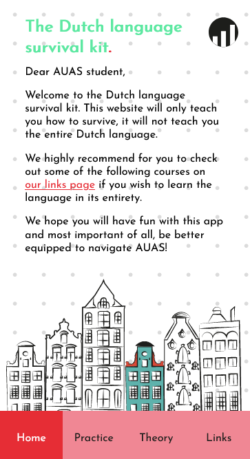
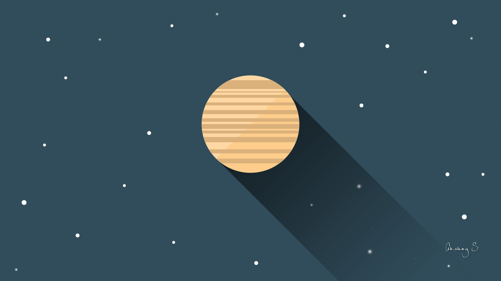
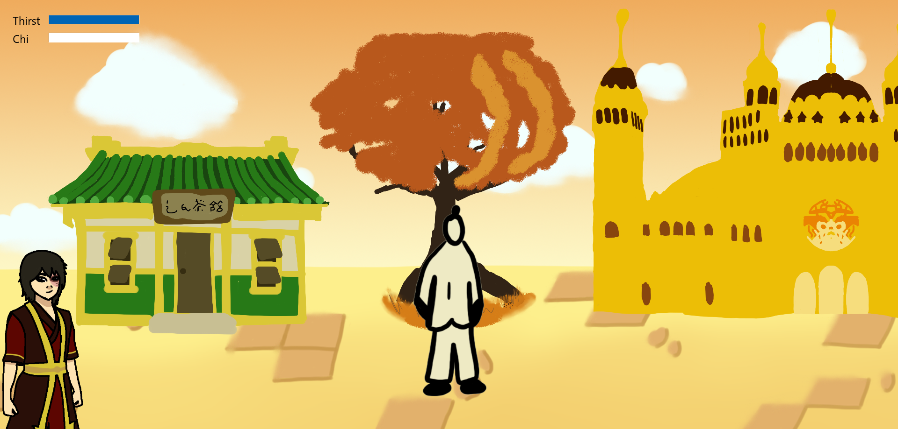

# Leo Kramer - Portfolio Front-end Developer

## Inhoudsopgave
- [Over mij](#over-mij)
- [Het ISGA project](#het-isga-project)
- [Met CSS spelen](#met-css-spelen)
- [Avatar spel](#avatar-spel)
- [Contact](#contact)

## Over mij
Hallo mijn naam is Leo.
Tijdens mijn studie heb ik vooral ontdekt dat ik iemand ben die dol op dingen maken. Vooral bij vakken waarbij ik websites kon bouwen vanaf het begin heb ik de meeste plezier uitgehaald. Het helemaal duiken in een idee en dat dan uit te gaan werken tot een product is waar ik het sterkst in lig.

Naast school hou ik mezelf ook continu bezig. Ik ben secretaris bij IAM Core, ik ben student-assistent binnen mijn studie, en ik geef bij Lyceo Codelab aan middelbare scholieren. Graag zou ik wel wat meer tijd willen vrijmaken voor verhalen schrijven, dat doe ik namelijk al sinds ik 7 ben en is één van mijn hobby’s die altijd bij me is gebleven.

## Het ISGA project

 

 
 <strong>Link naar het eindresultaat:</strong> https://oege.ie.hva.nl/~kramerl7/LeoKramer.Staal.Website/ (voor het project moesten we het specifiek voor het scherm van de iPhone 7/6/8  Plus coderen, daarom ziet het er alleen goed uit op die resolutie).
 
 ### Opdracht
 Periode: Jaar 1 Blok 1 
Vak: Project Individueel 1 
Voor het ISGA project moesten ik een digitale uitbreiding maken van het International Student Guide Amsterdam. Als randvoorwaarden had ik het volgende meegekregen:
-	De digitale uitbreiding is een prototype. Niks hoeft dus werkend te zijn als het maar duidelijk is wat het doet.
-	De uitbreiding moet gecodeerd zijn in HTML en CSS.
-	Het prototype moet een uitbreiding zijn, dus het moet niet het boek zelf zijn. Tegelijkertijd moet er ook wel iets van het boek in terug te vinden zijn.
-	Het prototype moet gecodeerd worden voor een iPhone 7/6/8 Plus scherm, responsiveness maakt niet uit.
 
 ### Proces
 Ik had bij de eerste week wat vertraging opgelopen, omdat ik niet een goed idee had wat de opdrachtgever precies zocht qua uitbreiding. Zodra ik door had dat ik best wel wat vrijheid had binnen het project had ik al een idee:

 Mijn concept was “The Dutch Language Survival Kit”. Deze uitbreiding focust zich specifiek op internationale studenten in het HvA een goede start te geven in het leren van de Nederlandse taal. Wat het anders maakt dan andere taal leer producten is dat deze specifiek woorden en zinnen leert die voor een student bij het HvA heel erg toepas komt.

Ik had voor het project wel een beetje kennis van HTML en CSS aangezien ik informatica had gehad bij de middelbare school, maar ik merkte wel dat ik dit al een stapje hoger was. Daarom duurde het wel even een tijd voordat ik echt begreep wat ik aan het doen was (ik had vooral moeite om de menubalk netjes te krijgen). Maar zodra ik dat door had ging het wel lekker.

Ik merkte wel wat echt de bal liet rollen was toen ik ging coderen en testen. Elke keer kwam ik een stapje dichterbij en dat gaf me zo veel energie dat ik bij de laatste week van het project zo’n beetje de hele dag daarmee was totdat ik het eindproduct had .

Eindproduct: https://oege.ie.hva.nl/~kramerl7/LeoKramer.Staal.Website/
 
 ### Reflectie
 Aangezien dit het begin van mijn opleiding was vond ik dit wel een goede start. Tuurlijk er zijn heel veel verbeteringen die gemaakt kunnen worden (bijvoorbeeld dat er echt tientallen html bestanden zijn, ik denk dat je dat aantal wel kan verkleinen als je met CSS een beetje speelt), maar alsnog ben ik heel erg trots op dit resultaat. Vooral vond ik de laatste week van het project het leukst en dat is één van de redenen waarom ik front-end development wil doen.
 

## Met CSS spelen

 

 <strong>Link naar het eindresultaat:</strong> https://oege.ie.hva.nl/~kramerl7/LeoKramer.Staal.MetCSSSpelen/
 
 ### Opdracht
 Periode: Jaar 1 Blok 3 
Vak: SRP cursus- met CSS spelen 
In blok 3 mochten we voor één week een cursus volgen. Ik besloot een CSS cursus te nemen, omdat ik me graag nog wou verdiepen in CSS om echt een goede grip erover te hebben.

Bij deze opdracht moesten we met CSS een kunstwerk maken en als je tijd over had kon je nog wat animaties daarbij toevoegen. Als randvoorwaarden had ik het volgende meegekregen:
-	Je mag geen afbeeldingen gebruiken.
-	Responsiveness en hoe netjes je code is maakt niet uit.
-	Je kunstwerk kan je maken op basis van een al bestaande afbeelding.
 
 ### Proces
  Aangezien de cursus kort was wou ik vooral een simpele afbeelding namaken:

Ik merkte wel dat ik hem al snel klaar had, dus toen begon ik met animaties te werken. Elke keer breidde ik het uit totdat ik het eindresultaat kreeg: de planeet rond de zon, een maan rond de planeet, de zon draaiend in zichzelf, en een schaduw die altijd achter de planeet staat.

Wat vooral lastig was bij de animatie was de schaduw en de maan, die moesten namelijk meedraaien met de planeet. Als oplossing heb ik een onzichtbaar draaiend voorwerp genaamd “zonnestelsel”, de maan en schaduw draaien met het zonnestelsel mee waardoor het lijkt als die meegaan met de planeet.

Eindproduct: https://oege.ie.hva.nl/~kramerl7/LeoKramer.Staal.MetCSSSpelen/
 
 ### Reflectie
 Als ik terug kijk naar mijn code vind ik dat het slordig uitziet en sommige oplossing ook een beetje “vies” gedaan zijn. De opdracht zei niet per se dat dat erg was, maar ik zou graag in de toekomst bij dit project terug willen gaan om het wat op te gaan ruimen. Ik vind namelijk het resultaat heel mooi en ik vind het ook super cool dat het me is gelukt om met code iets visueels eruit hebben kunnen krijgen.
 

## Avatar spel

 

 <strong>Link naar het eindresultaat:</strong> https://oege.ie.hva.nl/~kramerl7/Leo.Kramer.InleidingProgrammeren.Eindopdracht/
 
 ### Opdracht
 Periode: Jaar 1 Blok 4 
Vak: Inleiding Programmeren 
Bij Inleiding Programmeren leerde ik de basis van Javascript, een taal waarmee ik nooit eerder heb gewerkt.

Bij deze opdracht moesten we een spel maken met als inspiratie Tamagotchi.
 
 ### Proces
 Rond dit jaar heb ik af en toe de kans genomen om Griekse mythologie te verwerken in mijn ideeën aangezien ik dat onderwerp interessant vind. Voor dit vak wou ik een ander onderwerp kiezen die ik leuk vond om mezelf ook iets nieuws te geven, daarom wou ik “Avatar: The Last Airbender” verwerken in mijn opdracht.

Het bedenken van de spelelementen was niet heel lastig. Bij tamagotchi heb je vaak een karakter die je onderhoud, voor de rest kan je zelf beslissen of daarnaast nog iets gebeurt. Bij Avatar komt vaak veel training en vechten naar voren dus ik focuste vooral op een karakter die kon trainen in “bending” en daarna dat ook kon laten zien.

Gelijk merkte ik ook dat ik veel liever zelf de visuele elementen wou tekenen. Voor de opdracht was dat niet per se nodig en mocht je gewoon plaatjes van het internet halen, maar ik vond het zelf ook gewoon fijn om naast het coderen ook te kunnen tekenen voor dit project.

Wat vooral heel veel moeite kostte was het vecht systeem. In het spel is er een geheime waarde die “knowledge” heet, hoe meer je traint hoe meer je die opbouwt. Wat vooral lastig was is dat die variabele weer van toepassing kwam bij de volgende pagina (en javascript onthoud dat automatisch niet). Uiteindelijk heb ik een oplossing daarvoor gevonden met behulp van session storage.

Eindproduct: https://oege.ie.hva.nl/~kramerl7/Leo.Kramer.InleidingProgrammeren.Eindopdracht/ 
 
 ### Reflectie
 Helaas kwam ik wel in tijdsnood bij het einde van het project, ik had best wel wat ambities er namelijk voor. In het begin wou ik dat je kon kiezen welk element je wou spelen en afhankelijk van die keuze zou je dan een andere trainer krijgen en zou je ook echt een ander element gebruiken.

Ook wou ik graag extra tijd hebben om de arena verder uit te werken. Nu kan je alleen laten zien wat je hebt geleerd, maar je kan het niet toepassen. Om echt gevecht te laten lopen lijkt me wel heel lastig om te regelen, maar ik denk dat het gelijk ook het spel heel erg leuk maakt.

Alsnog ben ik trots dat ik het concept van het spel naar voren heb laten komen, en ik vind het spel ook gewoon leuk om af en toe te laten zien aan mensen. Ik ben gewoon ontzettend trots met het resultaat en ik zou het graag in de toekomst willen uitbreiden.
 

## Contact
- E-mail: leokramer17@gmail.com
- Telefoonnummer: 06 45 92 10 49
- Linkedin: https://www.linkedin.com/in/leo-kramer-aaa825224/
